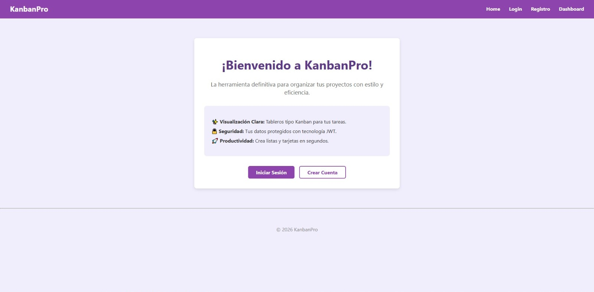

# 📋 KanbanPro



Aplicación web **Full Stack** para la gestión de tareas basada en la metodología **Kanban**, que permite organizar proyectos mediante tableros, listas y tarjetas.

---

## 📌 Descripción

**KanbanPro** es una aplicación web desarrollada para gestionar tareas y proyectos utilizando la metodología Kanban.

La aplicación permite a los usuarios:

* Crear tableros de trabajo
* Crear listas dentro de cada tablero
* Agregar tarjetas con tareas
* Organizar visualmente el progreso de un proyecto

Este proyecto demuestra el desarrollo de una aplicación **Full Stack**, integrando frontend, backend y base de datos.

---

## 🚀 Demo en Vivo

🔗 https://kanbanpro.onrender.com

---

## 🛠️ Tecnologías Utilizadas

### Frontend

* HTML
* CSS
* Bootstrap
* Handlebars

### Backend

* Node.js
* Express

### Base de Datos

* PostgreSQL
* Sequelize ORM

### Otras herramientas

* Git
* GitHub
* Render

---

## ⚙️ Instalación

1️⃣ Clonar el repositorio

```bash
git clone https://github.com/aberriosdev/kanbanpro.git
```

2️⃣ Entrar al proyecto

```bash
cd kanbanpro
```

3️⃣ Instalar dependencias

```bash
npm install
```

4️⃣ Crear archivo `.env`

```
DATABASE_URL=tu_url_de_base_de_datos
```

5️⃣ Ejecutar el servidor

```bash
npm start
```

La aplicación se ejecutará en:

```
http://localhost:3000
```
---

## 👩‍💻 Autora

**Paulina Berríos**

GitHub
https://github.com/aberriosdev

---

## 📬 Contacto

Portfolio
https://aberriosdev.github.io/mi-portafolio
